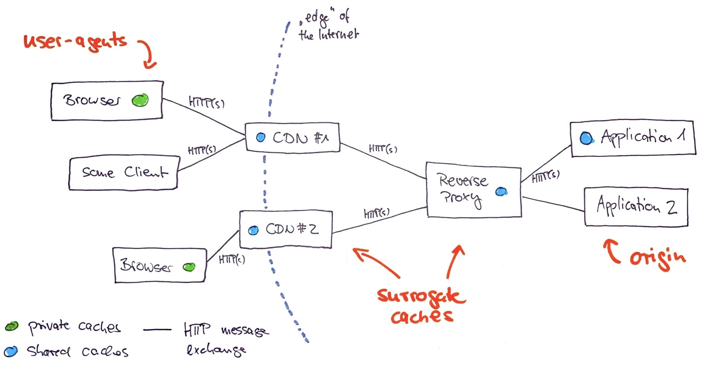

theme: Franziska, 8

[.header: alignment(left), Courier]
# GET /HTTP-Caching-101
### Host: SymfonyCon.Amsterdam
### Date: Thu, 21 Nov 2019 14:30:00 GMT

```php
```
Matthias Pigulla \<mp@webfactory.de>
webfactory GmbH, Bonn – Germany

---

# [fit] 34 • 17 = ? 

---

# If I'd speak HTTP… 🤓

```
GET /multiply?a=34&b=17 HTTP/1.1
Host: cal.culat.or
```

```
-> https://cal.culat.or/multiply?a=34&b=17
```

--- 

# Cache Key

```
[ 
    "GET",
    "https://cal.culat.or/multiply?a=34&b=17",
    "..." // ignore for now   
]
```

---

# Cacheable HTTP Methods

(RFC 7231 Section 4.2.3)

* GET
* HEAD
* POST (_must_ write through 🤕)

---

# Status codes cacheable *by default*

(RFC 7231 Section 6.1)
  
* 200 OK
* 301 Moved permanently
* 404 Not found
* ...

---

[.background-color: #FFFFFF]



---

# Further reading

* RFC 7234 – HTTP/1.1: Caching
* RFC 7231 – HTTP/1.1: Semantics and Content
* RFC 7232 – HTTP/1.1: Conditional Requests

--- 

```php
```

# (Here be live coding)

---

```php
```

# Be careful with `public` 🤕

---

```php
```

# `Vary` Header 🏳️‍🌈 

---

```php
```

# [fit] Edge Side Includes (ESI)

---

[.background-color: #FFFFFF]

     
---

```php
```
# github.com/webfactory/
# symfony-http-caching-demo

---

```php

```
# [fit] Questions

---

```php

```
# [fit] 🍻 🙌🏻 🚀

---

# Matthias Pigulla (`mpdude`)
## webfactory GmbH, Bonn – Germany
## mp@webfactory.de // @mpdude_de

```php
```

# github.com/webfactory/symfony-http-caching-demo
